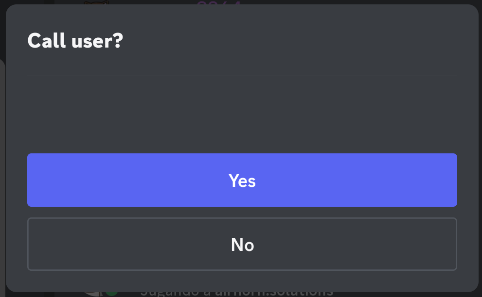
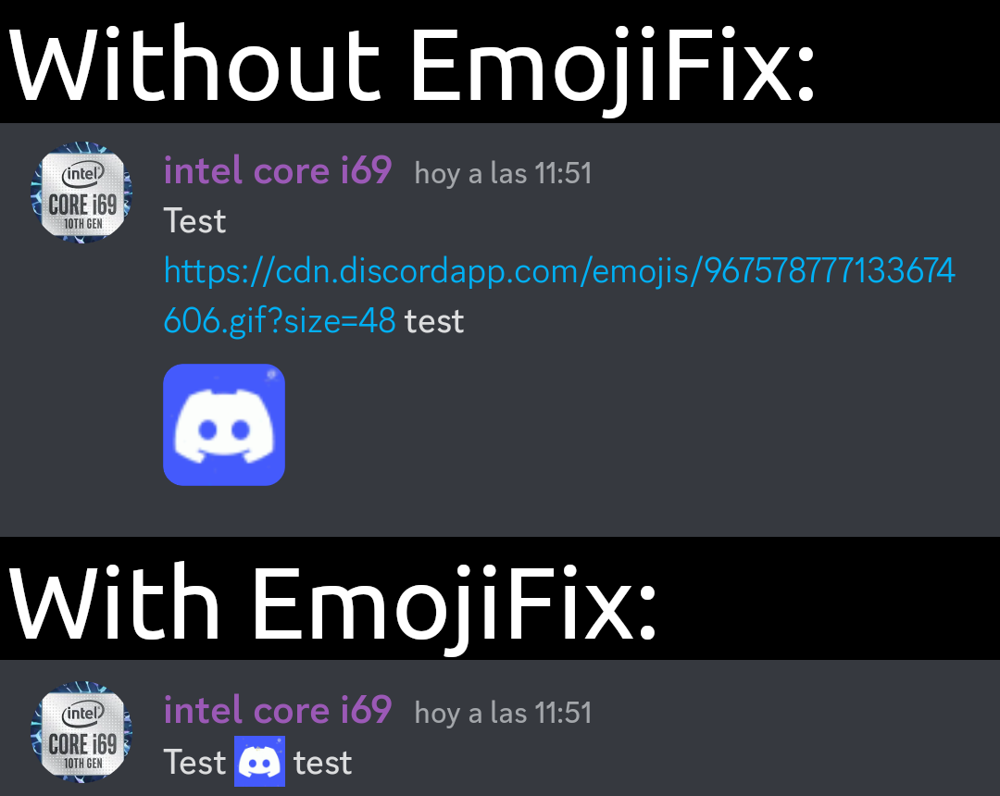
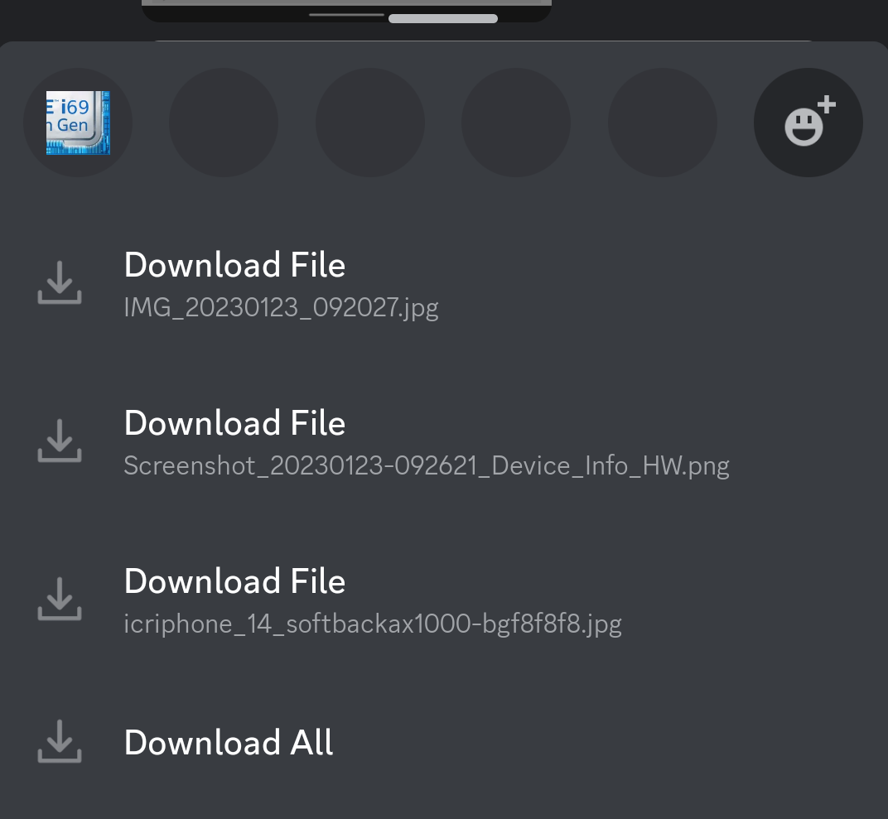
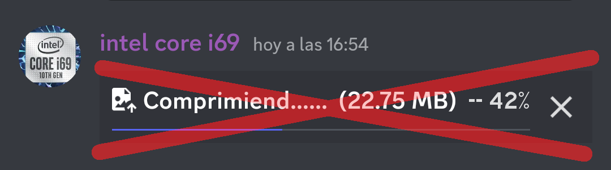

# Plugins for AliucordRN

> **Warning**
>
> AliucordRN is still in beta,therefore any of these plugins could break anytime and they have to be manually installed

> **Warning**
>
> All plugins have been compiled for hermes bytecode v89 due to a recent update

## [ConfirmCall](https://github.com/Martinz64/AliucordRN-Plugins/raw/builds/ConfirmCall.zip)
Asks for confirmation when starting a voice/video call and sending a friend request

## [EmojiFix](https://github.com/Martinz64/AliucordRN-Plugins/raw/builds/EmojiFix.zip)
Makes emoji urls look like real emoji

## [QuickDownload](https://github.com/Martinz64/AliucordRN-Plugins/raw/builds/QuickDownload.zip)
Lets you download attachments from the message long press menu

## [NoVideoCompression](https://github.com/Martinz64/AliucordRN-Plugins/raw/builds/NoVideoCompression.zip)
Prevents Discord from compressing images/videos when uploading them (file size limit still applies)

## [DoubleTapReply](https://github.com/Martinz64/AliucordRN-Plugins/raw/builds/DoubleTapReply.zip)
Reply to messages by douple tapping them